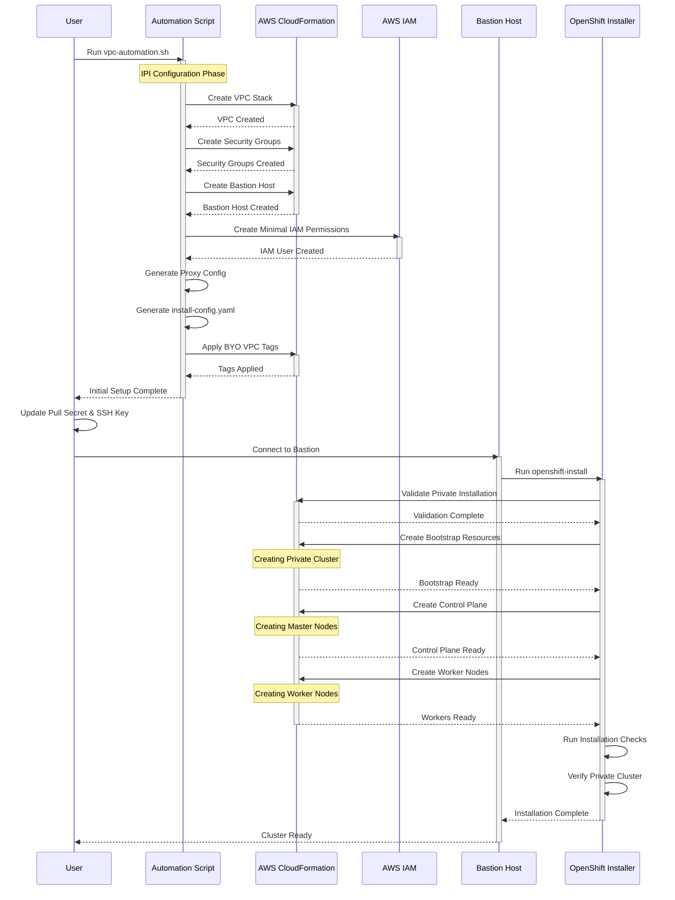

# AWS VPC IPI Configuration for OpenShift

This directory contains the configuration files and automation scripts needed to set up a custom VPC environment for OpenShift installation using the IPI (Installer Provisioned Infrastructure) method.

## Enhanced Automation Scripts

### 1. Enhanced VPC Creation (`create-vpc.sh`)
A comprehensive script that creates a production-ready VPC with multi-AZ support, shared VPC capabilities, and proper networking configuration.

**Features:**
- Multi-AZ deployment across 3 availability zones
- Shared VPC with resource sharing capabilities
- DHCP options and S3 endpoints
- Comprehensive output management
- CloudFormation-based infrastructure

**Usage:**
```bash
./create-vpc.sh --cluster-name my-cluster --region us-east-1
```

### 2. Bastion Host Creation (`create-bastion.sh`)
Creates a bastion host for accessing private OpenShift clusters with pre-installed OpenShift tools.

**Features:**
- Support for both Amazon Linux 2023 (recommended) and RHCOS
- Pre-installed OpenShift CLI and installer
- AWS CLI v2 and other management tools
- Enhanced security group configuration
- IAM role integration
- Automatic tool installation and environment setup

**Usage:**
```bash
# Amazon Linux 2023 (recommended for oc 4.18+ compatibility)
./create-bastion.sh --cluster-name my-cluster

# RHCOS (experimental)
./create-bastion.sh --cluster-name my-cluster --use-rhcos yes
```

### 3. OpenShift Deployment (`deploy-openshift.sh`)
Deploys an OpenShift cluster using the VPC output from the VPC creation script.

**Features:**
- Automatic install-config.yaml generation from VPC output
- OpenShift installer download and execution
- Support for both external and internal publishing
- Proper schema handling for different OpenShift versions

**Usage:**
```bash
./deploy-openshift.sh --cluster-name my-cluster --base-domain example.com
```

## Complete Workflow

### Step 1: Create VPC Infrastructure
```bash
./create-vpc.sh --cluster-name my-cluster --region us-east-1
```

### Step 2: Deploy OpenShift Cluster
```bash
./deploy-openshift.sh --cluster-name my-cluster --base-domain example.com
```

### Step 3: Create Bastion Host (for private clusters)
```bash
./create-bastion.sh --cluster-name my-cluster
```

### Step 4: Access Your Cluster
```bash
# Copy kubeconfig to bastion
scp -i ./bastion-output/my-cluster-bastion-key.pem ./openshift-install/auth/kubeconfig ec2-user@<bastion-ip>:/home/ec2-user/openshift/

# SSH to bastion and access cluster
ssh -i ./bastion-output/my-cluster-bastion-key.pem ec2-user@<bastion-ip>
export KUBECONFIG=~/openshift/kubeconfig
oc get nodes
```

## Configuration Files

1. `aws-provision-vpc-shared.yaml`
   - Creates a shared VPC with public and private subnets
   - Configures DNS settings and necessary tags
   - Customizable CIDR blocks for VPC and subnets

2. `aws-provision-security-group.yaml`
   - Defines security groups for control plane and worker nodes
   - Sets up internal cluster communication rules
   - Configures necessary inbound/outbound rules

3. `aws-provision-bastionhost.yaml`
   - Provisions a bastion host in the public subnet
   - Installs necessary tools (aws-cli, openshift-client)
   - Configures SSH access

4. `ipi-conf-aws.yaml`
   - Main IPI installation configuration
   - Defines cluster architecture and networking
   - Configures AWS-specific settings

5. `aws-provision-iam-user-minimal-permission.yaml`
   - Creates IAM user with minimal required permissions
   - Sets up region-specific access
   - Implements resource tagging restrictions

## Legacy Automation Script

The `vpc-automation.sh` script is the original automation script that combines VPC creation and OpenShift deployment in a single script. It's still available for backward compatibility but the new modular approach is recommended for production use.

### Prerequisites

- AWS CLI installed and configured with appropriate credentials
- Bash shell environment
- AWS account with sufficient permissions to create VPC resources
- OpenShift pull secret (for cluster installation)
- SSH key pair for cluster access

### Usage

1. Make the script executable:
   ```bash
   chmod +x vpc-automation.sh
   ```

2. Run the script with desired options:
   ```bash
   ./vpc-automation.sh \
     --region us-east-1 \
     --vpc-cidr 10.0.0.0/16 \
     --cluster-name my-cluster \
     --base-domain example.com \
     --private-subnets 3 \
     --pull-secret '{"auths":{"cloud.openshift.com":{"auth":"..."}}}' \
     --ssh-key "ssh-rsa AAAA..."
   ```

### Script Options

- `--region`: AWS region (default: us-east-1)
- `--vpc-cidr`: VPC CIDR block (default: 10.0.0.0/16)
- `--cluster-name`: OpenShift cluster name (default: my-cluster)
- `--base-domain`: Base domain for the cluster (default: example.com)
- `--private-subnets`: Number of private subnets (default: 3)
- `--pull-secret`: Red Hat pull secret (as string)
- `--pull-secret-file`: Path to file containing Red Hat pull secret
- `--ssh-key`: SSH public key (as string)
- `--ssh-key-file`: Path to SSH public key file
- `--instance-type`: Bastion instance type (default: t3.micro)
- `--help`: Display help message

### Usage Examples

1. Make the script executable:
   ```bash
   chmod +x vpc-automation.sh
   ```

2. Run with direct values:
   ```bash
   ./vpc-automation.sh \
     --region us-east-1 \
     --vpc-cidr 10.0.0.0/16 \
     --cluster-name my-cluster \
     --base-domain example.com \
     --private-subnets 3 \
     --pull-secret '{"auths":{"cloud.openshift.com":{"auth":"..."}}}' \
     --ssh-key "ssh-rsa AAAA..."
   ```

3. Run with files:
   ```bash
   ./vpc-automation.sh \
     --region us-east-1 \
     --vpc-cidr 10.0.0.0/16 \
     --cluster-name my-cluster \
     --base-domain example.com \
     --private-subnets 3 \
     --pull-secret-file ~/pull-secret.txt \
     --ssh-key-file ~/.ssh/id_rsa.pub
   ```

### What the Script Does

1. Creates a VPC with specified CIDR block
2. Sets up public and private subnets across multiple availability zones
3. Configures Internet Gateway and NAT Gateway
4. Creates appropriate route tables and associations
5. Generates the `install-config.yaml` with proper VPC and subnet configurations
6. Configures pull secret and SSH key for cluster access
7. Sets up private cluster configuration with internal publishing

### Post-Script Steps

After running the script:

1. Review the generated install-config.yaml
2. Run the OpenShift installer:
   ```bash
   openshift-install create cluster --dir=./
   ```

## Manual Usage

If you prefer to set up resources manually, you can still use the individual YAML files:

1. VPC Provisioning:
   ```bash
   oc process -f aws-provision-vpc-shared.yaml \
     -p vpc_name=my-vpc \
     -p region=us-east-1 | oc apply -f -
   ```

2. Security Group Setup:
   ```bash
   oc process -f aws-provision-security-group.yaml \
     -p vpc_name=my-vpc \
     -p cluster_name=my-cluster | oc apply -f -
   ```

3. Bastion Host Creation:
   ```bash
   oc process -f aws-provision-bastionhost.yaml \
     -p vpc_name=my-vpc \
     -p key_name=my-key | oc apply -f -
   ```

4. IPI Configuration:
   ```bash
   oc process -f ipi-conf-aws.yaml \
     -p cluster_name=my-cluster \
     -p base_domain=example.com \
     -p vpc_id=vpc-xxx \
     -p private_subnet_id=subnet-xxx \
     -p public_subnet_id=subnet-yyy | oc apply -f -
   ```

5. IAM User Setup:
   ```bash
   oc process -f aws-provision-iam-user-minimal-permission.yaml \
     -p cluster_name=my-cluster \
     -p region=us-east-1 | oc apply -f -
   ```

## Important Notes

- **Amazon Linux 2023**: Recommended for bastion hosts when using OpenShift 4.18+ due to glibc compatibility
- **Private Clusters**: Default configuration creates private clusters accessible only through bastion host or VPN
- **Multi-AZ**: Enhanced VPC creation supports multi-AZ deployment for high availability
- **Security**: All resources are tagged with appropriate OpenShift cluster tags
- **IAM Permissions**: Scoped to specific regions and resources for security
- **Backup**: Always back up the generated `install-config.yaml` as it will be consumed by the installer

## CloudFormation Details

The automation script uses AWS CloudFormation to provision and manage the VPC infrastructure. Here are important details about the CloudFormation implementation:

### Stack Resources

The CloudFormation template (`vpc-template.yaml`) creates the following resources:
- VPC with DNS support enabled
- Internet Gateway for public access
- NAT Gateway for private subnet internet access
- Public subnet for NAT Gateway
- Multiple private subnets for OpenShift nodes
- Route tables for both public and private subnets
- Necessary route table associations

### Stack Parameters

The CloudFormation stack accepts the following parameters:
- `VpcCidr`: The CIDR block for the VPC
- `ClusterName`: Name used for resource tagging

### Stack Outputs

The stack provides these outputs:
- `VpcId`: ID of the created VPC
- `PublicSubnetId`: ID of the public subnet
- `PrivateSubnetXId`: IDs of the private subnets (where X is the subnet number)

### CloudFormation Best Practices

1. **Stack Management**:
   - Use unique stack names prefixed with cluster name
   - Always check stack events for troubleshooting
   - Wait for stack operations to complete before proceeding

2. **Resource Cleanup**:
   - Delete stacks in reverse dependency order
   - Ensure all resources are properly tagged
   - Use `aws cloudformation delete-stack` for cleanup

3. **Error Handling**:
   - The script includes error checking for stack creation
   - Stack events are logged to the artifacts directory
   - Failed stack creations are detected and reported

4. **Resource Limits**:
   - Consider AWS service limits when creating multiple stacks
   - Default limit of 5 VPCs per region
   - NAT Gateway and EIP limits may apply

### CloudFormation Template Structure

The template follows AWS best practices:
```yaml
AWSTemplateFormatVersion: '2010-09-09'
Description: VPC for OpenShift IPI Installation

Parameters:
  # Stack parameters
Resources:
  # VPC and networking resources
Outputs:
  # Resource identifiers
```

### Troubleshooting CloudFormation

1. **Stack Creation Failures**:
   ```bash
   aws cloudformation describe-stack-events \
     --stack-name <stack-name> \
     --region <region>
   ```

2. **Resource Status Check**:
   ```bash
   aws cloudformation describe-stack-resources \
     --stack-name <stack-name> \
     --region <region>
   ```

3. **Stack Deletion Issues**:
   - Check for dependencies between resources
   - Verify IAM permissions
   - Look for resources that may prevent deletion

### CloudFormation Security Considerations

1. **IAM Permissions**:
   - Use minimal required permissions
   - Scope permissions to specific resources
   - Consider using AWS Organizations for multi-account setups

2. **Network Security**:
   - Private subnets have no direct internet access
   - NAT Gateway provides controlled outbound access
   - Security group rules are restrictive by default

3. **Resource Protection**:
   - Enable termination protection for production stacks
   - Use stack policies to prevent unintended updates
   - Implement proper tagging for resource tracking

### Integration with OpenShift

The CloudFormation stack is designed to work seamlessly with OpenShift IPI installation:
- Subnet configuration matches OpenShift requirements
- Network architecture supports private cluster deployment
- Resource tags are compatible with OpenShift installer

For more information about AWS CloudFormation, visit the [AWS CloudFormation Documentation](https://docs.aws.amazon.com/cloudformation/).

## Installation Process

The following sequence diagram illustrates the complete installation process, including bastion host setup and private cluster configuration:



### Installation Chain

The installation process follows this specific chain of operations:

1. **IPI Configuration Setup**
   - `ipi-conf`: Initial IPI configuration
   - `aws-provision-vpc-shared`: Create shared VPC infrastructure
   - `aws-provision-security-group`: Configure security groups
   - `ipi-conf-aws-custom-vpc`: Custom VPC configuration
   - `ipi-conf-aws`: AWS-specific IPI settings
   - `ipi-conf-aws-custom-security-groups`: Custom security group settings

2. **Bastion and Access Setup**
   - `aws-provision-bastionhost`: Create and configure bastion host
   - `proxy-config-generate`: Generate proxy configuration
   - `aws-provision-iam-user-minimal-permission`: Set up minimal IAM permissions

3. **Installation and Verification**
   - `ipi-install`: Run OpenShift installation
   - `aws-provision-tags-for-byo-vpc`: Apply necessary tags for bring-your-own VPC
   - `cucushift-installer-check`: Verify installation
   - `cucushift-installer-check-aws-private`: Validate private cluster setup

### Component Details

1. **Bastion Host Configuration**
   - Serves as jump host for private cluster access
   - Includes required tools (openshift-install, oc, aws CLI)
   - Configured with necessary permissions and access
   - Located in public subnet with access to private subnets

2. **Security Group Setup**
   - Bastion host security group with minimal inbound access
   - Cluster security groups for internal communication
   - Custom security groups for specific requirements
   - Network isolation rules for private cluster

3. **IAM Configuration**
   - Minimal permission IAM user for installation
   - Role-based access control
   - Scoped permissions for security
   - Temporary credentials management

### Estimated Timeline

- Initial Setup: ~5-10 minutes
- VPC and Security: ~10-15 minutes
- Bastion Host: ~5-10 minutes
- IAM Setup: ~5 minutes
- Bootstrap Phase: ~15-20 minutes
- Control Plane: ~20-25 minutes
- Worker Nodes: ~15-20 minutes
- Final Verification: ~10 minutes
- Total Installation: ~85-115 minutes

### Monitoring and Verification

1. **From Bastion Host**
   ```bash
   # Monitor installation progress
   openshift-install wait-for bootstrap-complete --dir=<install_dir>
   openshift-install wait-for install-complete --dir=<install_dir>
   
   # Check cluster status
   oc get clusterversion
   oc get nodes
   oc get co
   ```

2. **Installation Logs**
   ```bash
   # Bootstrap logs
   tail -f /var/lib/containers/storage/overlay-containers/bootstrap/bootstrap.log
   
   # Installation logs
   tail -f .openshift_install.log
   ```

3. **Verification Commands**
   ```bash
   # Verify private cluster
   oc get infrastructure cluster -o yaml
   
   # Check network configuration
   oc get network cluster -o yaml
   ```

### Troubleshooting Access

1. **Bastion Host Access**
   ```bash
   # SSH to bastion
   ssh -i <key_path> ec2-user@<bastion_public_ip>
   
   # Configure AWS credentials
   aws configure
   ```

2. **Cluster Access**
   ```bash
   # Copy kubeconfig
   mkdir -p ~/.kube
   cp <install_dir>/auth/kubeconfig ~/.kube/config
   
   # Test access
   oc whoami
   oc get nodes
   ```

For detailed troubleshooting steps and logs, refer to the OpenShift installation documentation.

## Bastion Host Details

The script automatically creates and configures a bastion host for cluster management. Here's how it works:

### 1. Security Group Creation
- Creates a dedicated security group for the bastion host
- Configures inbound SSH access (port 22)
- Places the bastion in the public subnet for external access

### 2. Instance Provisioning
- Uses latest Amazon Linux 2 AMI
- Launches in the public subnet with a public IP
- Configurable instance type (default: t3.micro)
- Creates and assigns a new SSH key pair

### 3. Automated Tool Installation
The bastion host is automatically configured with:
- AWS CLI v2
- OpenShift CLI (oc)
- OpenShift installer
- Required utilities (jq, wget, tar, etc.)

### 4. Access Configuration
```bash
# SSH access to bastion
ssh -i <cluster-name>-key.pem ec2-user@<bastion-public-ip>

# Default workspace
cd /home/ec2-user/openshift
```

### 5. Bastion Host Usage

1. **Initial Access**:
   ```bash
   # Copy install-config.yaml to bastion
   scp -i <cluster-name>-key.pem install-config.yaml ec2-user@<bastion-public-ip>:~/openshift/
   ```

2. **Cluster Installation**:
   ```bash
   # On bastion host
   cd ~/openshift
   openshift-install create cluster --dir=./
   ```

3. **Cluster Management**:
   ```bash
   # On bastion host
   export KUBECONFIG=~/openshift/auth/kubeconfig
   oc get nodes
   oc get co
   ```

### 6. Security Considerations

- Bastion host is the only entry point to the private cluster
- SSH access is restricted by security group rules
- Instance is placed in public subnet with direct internet access
- Private cluster components are only accessible through bastion
- AWS credentials should be configured on bastion for cluster management

### 7. Maintenance

1. **System Updates**:
   ```bash
   sudo yum update -y
   ```

2. **Tool Updates**:
   ```bash
   # Update OpenShift CLI
   sudo curl -O https://mirror.openshift.com/pub/openshift-v4/clients/ocp/latest/openshift-client-linux.tar.gz
   sudo tar xvf openshift-client-linux.tar.gz -C /usr/local/bin
   ```

3. **Monitoring**:
   ```bash
   # Check system resources
   top
   df -h
   
   # Check OpenShift status
   oc get clusterversion
   oc get clusteroperators
   ```

For more information about bastion host setup, refer to the OpenShift installation documentation.

## 🗑️ 安全删除VPC

当您需要删除VPC和所有相关资源时，我们提供了一个安全的删除脚本。

### 快速删除

```bash
# 给删除脚本执行权限
chmod +x delete-vpc.sh

# 预览删除（推荐先运行）
./delete-vpc.sh --cluster-name my-cluster --dry-run

# 执行删除
./delete-vpc.sh --cluster-name my-cluster

# 强制删除（跳过确认）
./delete-vpc.sh --cluster-name my-cluster --force
```

### 删除脚本功能

删除脚本会按正确顺序删除以下资源：

1. **OpenShift集群** - 使用官方删除命令
2. **Bastion主机** - 终止EC2实例
3. **SSH密钥对** - 删除相关密钥
4. **VPC堆栈** - 删除CloudFormation堆栈
5. **输出目录** - 清理本地文件

### 高级选项

```bash
# 跳过某些组件的删除
./delete-vpc.sh \
  --cluster-name my-cluster \
  --skip-openshift \
  --skip-bastion

# 指定不同的输出目录
./delete-vpc.sh \
  --cluster-name my-cluster \
  --vpc-output-dir ./custom-vpc-output \
  --bastion-output-dir ./custom-bastion-output \
  --openshift-install-dir ./custom-openshift-install

# 使用不同的AWS区域
./delete-vpc.sh \
  --cluster-name my-cluster \
  --region us-west-2
```

### 手动删除

如果自动化脚本无法使用，可以手动删除：

```bash
# 1. 删除OpenShift集群
cd openshift-install
./openshift-install destroy cluster

# 2. 删除Bastion主机
INSTANCE_ID=$(cat ../bastion-output/bastion-instance-id)
aws ec2 terminate-instances --instance-ids $INSTANCE_ID

# 3. 删除SSH密钥对
aws ec2 delete-key-pair --key-name my-cluster-key
aws ec2 delete-key-pair --key-name my-cluster-bastion-key

# 4. 删除VPC堆栈
STACK_NAME=$(cat ../vpc-output/stack-name)
aws cloudformation delete-stack --stack-name $STACK_NAME

# 5. 清理本地文件
rm -rf vpc-output bastion-output openshift-install *.pem
```

### 验证删除

删除完成后，验证所有资源都已正确删除：

```bash
# 检查CloudFormation堆栈
aws cloudformation describe-stacks --stack-name my-cluster-vpc-1234567890

# 检查VPC
VPC_ID=$(cat vpc-output/vpc-id)
aws ec2 describe-vpcs --vpc-ids $VPC_ID

# 检查EC2实例
aws ec2 describe-instances \
  --filters "Name=tag:kubernetes.io/cluster/my-cluster,Values=owned"

# 检查SSH密钥对
aws ec2 describe-key-pairs --key-names my-cluster-key
```

### 重要警告

⚠️ **删除VPC是一个不可逆的操作！** 删除后，所有相关的AWS资源将被永久删除，包括：
- OpenShift集群和所有节点
- 所有EC2实例
- 网络配置（子网、路由表、NAT网关等）
- 存储卷
- 负载均衡器
- 安全组

### 删除前检查清单

在删除VPC之前，请确认：
- [ ] 已备份重要的数据和配置
- [ ] 已通知所有相关用户
- [ ] 确认没有生产工作负载在运行
- [ ] 已记录当前的网络配置（如需要）
- [ ] 已检查AWS账单，了解当前成本

详细说明请参考 [安全删除VPC指南](README-delete-vpc.md)。 