# AWS VPC Network Structure for Disconnected OpenShift Cluster

## Overview

This document describes the AWS VPC network architecture used for the disconnected OpenShift cluster deployment. The network structure supports a multi-cluster environment with proper security isolation and connectivity requirements.

## VPC Configuration

- **VPC ID**: `vpc-0585c6187173b24a9`
- **CIDR Block**: `10.0.0.0/16`
- **Region**: `us-east-1`
- **Name**: `weli-disconnected-cluster-1751362952-vpc`

## Network Architecture Diagram

```mermaid
graph TB
    subgraph "AWS VPC (10.0.0.0/16)"
        subgraph "Availability Zone: us-east-1a"
            subgraph "Private Subnet (10.0.1.0/24)"
                subgraph "Cluster 1: disconnected-cluster-n97rs"
                    CP1[Control Plane Nodes]
                    WN1[Worker Nodes]
                    NLB1[Network Load Balancer]
                end
                
                subgraph "Cluster 2: disconnected-cluster-r28tf"
                    CP2[Control Plane Nodes]
                    WN2[Worker Nodes]
                    NLB2[Network Load Balancer]
                end
                
                subgraph "Cluster 3: disconnected-cluster-vtr7q"
                    CP3[Control Plane Nodes]
                    WN3[Worker Nodes]
                    NLB3[Network Load Balancer]
                end
                
                subgraph "Cluster 4: disconnected-cluster-8vcmh"
                    CP4[Control Plane Nodes]
                    WN4[Worker Nodes]
                    NLB4[Network Load Balancer]
                end
            end
        end
        
        RT[Main Route Table]
        NACL[Default Network ACL]
        DSG[Default Security Group]
    end
    
    subgraph "Security Groups (Per Cluster)"
        SG1[Cluster 1 Security Groups]
        SG2[Cluster 2 Security Groups]
        SG3[Cluster 3 Security Groups]
        SG4[Cluster 4 Security Groups]
    end
    
    subgraph "External Access"
        INTERNET[Internet]
        BASTION[Bastion Host]
    end
    
    %% Connections
    CP1 --> NLB1
    WN1 --> NLB1
    CP2 --> NLB2
    WN2 --> NLB2
    CP3 --> NLB3
    WN3 --> NLB3
    CP4 --> NLB4
    WN4 --> NLB4
    
    NLB1 --> INTERNET
    NLB2 --> INTERNET
    NLB3 --> INTERNET
    NLB4 --> INTERNET
    
    BASTION --> CP1
    BASTION --> CP2
    BASTION --> CP3
    BASTION --> CP4
    
    SG1 -.-> CP1
    SG1 -.-> WN1
    SG1 -.-> NLB1
    SG2 -.-> CP2
    SG2 -.-> WN2
    SG2 -.-> NLB2
    SG3 -.-> CP3
    SG3 -.-> WN3
    SG3 -.-> NLB3
    SG4 -.-> CP4
    SG4 -.-> WN4
    SG4 -.-> NLB4
    
    style VPC fill:#e1f5fe
    style CP1 fill:#c8e6c9
    style CP2 fill:#c8e6c9
    style CP3 fill:#c8e6c9
    style CP4 fill:#c8e6c9
    style WN1 fill:#fff3e0
    style WN2 fill:#fff3e0
    style WN3 fill:#fff3e0
    style WN4 fill:#fff3e0
    style NLB1 fill:#f3e5f5
    style NLB2 fill:#f3e5f5
    style NLB3 fill:#f3e5f5
    style NLB4 fill:#f3e5f5
```

## Network Components

### Subnets
- **Private Subnet**: `10.0.1.0/24` in `us-east-1a`
  - Hosts all cluster nodes and internal services
  - Uses main route table for local routing

### Route Tables
- **Main Route Table**: Handles local VPC routing (`10.0.0.0/16` → `local`)

### Network ACLs
- **Default Network ACL**: Standard AWS default rules allowing all traffic

## Security Architecture

### Security Groups Per Cluster
Each cluster has three dedicated security groups:

1. **Control Plane Security Group**
   - Manages Kubernetes control plane nodes
   - Handles API server, etcd, and management traffic

2. **Node Security Group**
   - Manages Kubernetes worker nodes
   - Handles kubelet API and node port services

3. **API Server Load Balancer Security Group**
   - Manages Network Load Balancer for Kubernetes API
   - Controls external and internal API access

### Default Security Group
- Standard VPC default security group
- Allows all outbound traffic

## Load Balancers

Each cluster has a dedicated Network Load Balancer:
- Provides external access to Kubernetes API (port 6443)
- Handles Machine Config Server traffic (port 22623)
- Distributes traffic across control plane nodes

## Key Features

### Multi-Cluster Isolation
- Each cluster has dedicated security groups
- No cross-cluster communication by default
- Independent load balancers per cluster

### Kubernetes Networking
- Support for Geneve tunneling and VXLAN
- Node port services (30000-32767)
- Custom node port ranges (9000-9999)

### Security Controls
- Principle of least privilege
- Role-based access control
- Network segmentation
- Controlled external access

## Architecture Benefits

1. **Scalability**: Easy to add new clusters
2. **Security**: Proper isolation between clusters
3. **Management**: Centralized VPC with distributed clusters
4. **Reliability**: Independent load balancers per cluster
5. **Flexibility**: Support for different cluster configurations

This architecture provides a secure, scalable foundation for running multiple disconnected OpenShift clusters in AWS while maintaining proper network isolation and security controls. 