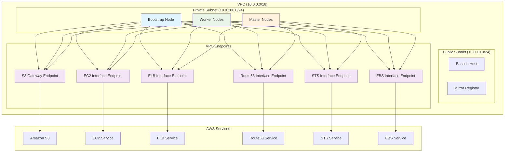

# VPC Endpoints for Disconnected OpenShift Cluster

## Overview

This document explains the VPC endpoints required for a disconnected OpenShift cluster deployment on AWS. VPC endpoints are critical for enabling private communication between your cluster nodes and AWS services without requiring internet access.

## Why VPC Endpoints Are Required

In a disconnected cluster environment:
- **Private subnets have no internet access** (no NAT Gateway)
- **Bootstrap and worker nodes** need to communicate with AWS services
- **Mirror registry alone is insufficient** for complete cluster functionality
- **VPC endpoints provide secure, private access** to AWS services

## Required VPC Endpoints

### 1. S3 Gateway Endpoint
- **Service**: `com.amazonaws.region.s3`
- **Type**: Gateway Endpoint
- **Purpose**: 
  - Access to S3 buckets for bootstrap ignition files
  - Download of cluster images and configurations
  - Storage of cluster logs and backups
- **Cost**: Free (Gateway endpoints have no additional charges)

### 2. EC2 Interface Endpoint
- **Service**: `com.amazonaws.region.ec2`
- **Type**: Interface Endpoint
- **Purpose**:
  - EC2 instance lifecycle management
  - Instance metadata service access
  - AMI and snapshot operations
  - Security group and network interface management
- **Cost**: ~$7.20/month per endpoint

### 3. ELB Interface Endpoint
- **Service**: `com.amazonaws.region.elasticloadbalancing`
- **Type**: Interface Endpoint
- **Purpose**:
  - Load balancer creation and management
  - Target group operations
  - Health check configuration
  - API server load balancer operations
- **Cost**: ~$7.20/month per endpoint

### 4. Route53 Interface Endpoint
- **Service**: `com.amazonaws.region.route53`
- **Type**: Interface Endpoint
- **Purpose**:
  - DNS resolution for cluster services
  - Hosted zone management
  - DNS record creation and updates
  - Internal service discovery
- **Cost**: ~$7.20/month per endpoint

### 5. STS Interface Endpoint
- **Service**: `com.amazonaws.region.sts`
- **Type**: Interface Endpoint
- **Purpose**:
  - Temporary security credentials
  - IAM role assumption
  - Cross-account access
  - Service account token exchange
- **Cost**: ~$7.20/month per endpoint

### 6. EBS Interface Endpoint
- **Service**: `com.amazonaws.region.ebs`
- **Type**: Interface Endpoint
- **Purpose**:
  - EBS volume operations
  - Snapshot management
  - Volume attachment/detachment
  - Persistent volume provisioning
- **Cost**: ~$7.20/month per endpoint

## Network Architecture



## Security Configuration

### VPC Endpoints Security Group
- **Inbound Rules**:
  - Port 443 (HTTPS) from VPC CIDR (10.0.0.0/16)
  - Protocol: TCP
- **Outbound Rules**:
  - All traffic (managed by AWS)

### Private DNS
- **Enabled** for all Interface endpoints
- Allows standard AWS service DNS names to resolve to private IP addresses
- No code changes required in applications

## Cost Estimation

| Component | Type | Monthly Cost | Annual Cost |
|-----------|------|-------------|-------------|
| S3 Gateway Endpoint | Gateway | $0.00 | $0.00 |
| EC2 Interface Endpoint | Interface | $7.20 | $86.40 |
| ELB Interface Endpoint | Interface | $7.20 | $86.40 |
| Route53 Interface Endpoint | Interface | $7.20 | $86.40 |
| STS Interface Endpoint | Interface | $7.20 | $86.40 |
| EBS Interface Endpoint | Interface | $7.20 | $86.40 |
| **Total VPC Endpoints** | | **$36.00** | **$432.00** |

*Note: Costs are based on us-east-1 pricing and may vary by region. Data transfer charges may apply.*

## Implementation in Script

The `01-create-infrastructure.sh` script automatically creates all required VPC endpoints:

```bash
# Create VPC endpoints for disconnected cluster
create_vpc_endpoints "$CLUSTER_NAME" "$REGION" "$vpc_id" "$private_subnet_ids" "$public_subnet_ids" "$OUTPUT_DIR"
```

### Output Files
The script creates the following output files in `infra-output/`:
- `s3-endpoint-id`: S3 Gateway endpoint ID
- `ec2-endpoint-id`: EC2 Interface endpoint ID
- `elb-endpoint-id`: ELB Interface endpoint ID
- `route53-endpoint-id`: Route53 Interface endpoint ID
- `sts-endpoint-id`: STS Interface endpoint ID
- `ebs-endpoint-id`: EBS Interface endpoint ID
- `vpc-endpoints-security-group-id`: Security group for endpoints

## Verification

### Check Endpoint Status
```bash
# Check all VPC endpoints
aws ec2 describe-vpc-endpoints --region us-east-1 --query 'VpcEndpoints[?VpcId==`vpc-xxxxxxxx`].[VpcEndpointId,ServiceName,State]' --output table

# Test S3 access from private subnet
aws s3 ls --region us-east-1 --endpoint-url https://s3.us-east-1.amazonaws.com

# Test EC2 access from private subnet
aws ec2 describe-instances --region us-east-1 --endpoint-url https://ec2.us-east-1.amazonaws.com
```

### DNS Resolution Test
```bash
# Test private DNS resolution
nslookup s3.us-east-1.amazonaws.com
nslookup ec2.us-east-1.amazonaws.com
nslookup elasticloadbalancing.us-east-1.amazonaws.com
```

## Troubleshooting

### Common Issues

1. **Endpoint Not Available**
   - Check if the service is available in your region
   - Verify endpoint type (Gateway vs Interface)
   - Ensure proper subnet selection

2. **DNS Resolution Fails**
   - Verify private DNS is enabled for Interface endpoints
   - Check VPC DNS settings (enableDnsHostnames, enableDnsSupport)
   - Verify Route53 resolver configuration

3. **Connection Timeouts**
   - Check security group rules (port 443 inbound)
   - Verify network ACLs allow HTTPS traffic
   - Ensure proper subnet routing

4. **Access Denied**
   - Verify IAM permissions for endpoint usage
   - Check endpoint policies
   - Ensure proper resource-based policies

### Debugging Commands

```bash
# Check endpoint details
aws ec2 describe-vpc-endpoints --vpc-endpoint-ids vpce-xxxxxxxx --region us-east-1

# Check security group rules
aws ec2 describe-security-groups --group-ids sg-xxxxxxxx --region us-east-1

# Check route tables
aws ec2 describe-route-tables --filters "Name=vpc-id,Values=vpc-xxxxxxxx" --region us-east-1

# Test connectivity from instance
curl -I https://s3.us-east-1.amazonaws.com
curl -I https://ec2.us-east-1.amazonaws.com
```

## Best Practices

1. **Endpoint Placement**
   - Place Interface endpoints in private subnets
   - Use multiple AZs for high availability
   - Associate with appropriate security groups

2. **Security**
   - Use least-privilege endpoint policies
   - Restrict access to specific VPC CIDRs
   - Monitor endpoint usage with CloudTrail

3. **Cost Optimization**
   - Use Gateway endpoints when available (S3, DynamoDB)
   - Consider regional data transfer costs
   - Monitor unused endpoints

4. **Monitoring**
   - Enable VPC Flow Logs
   - Monitor endpoint metrics in CloudWatch
   - Set up alerts for endpoint failures

## References

- [AWS VPC Endpoints Documentation](https://docs.aws.amazon.com/vpc/latest/userguide/vpc-endpoints.html)
- [OpenShift Disconnected Installation Guide](https://docs.openshift.com/container-platform/latest/installing/disconnected_install/index.html)
- [AWS PrivateLink Pricing](https://aws.amazon.com/privatelink/pricing/) 